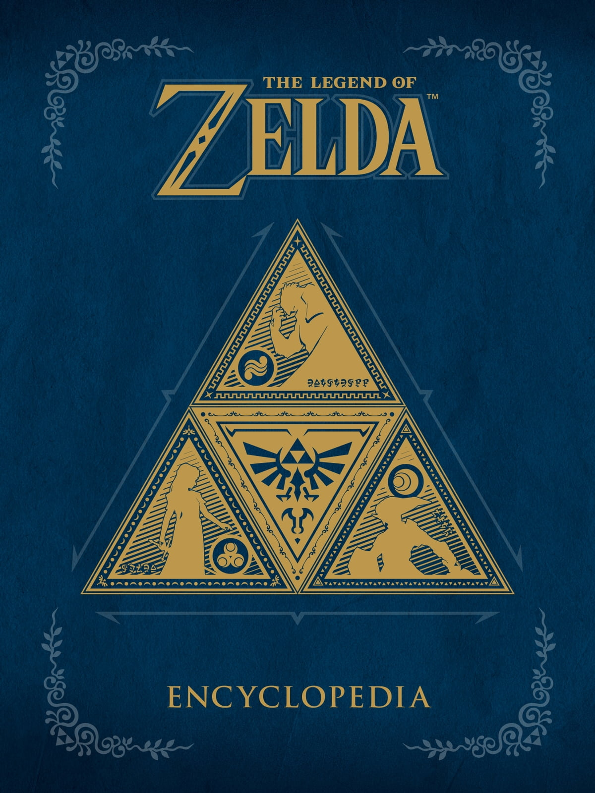

<!doctype html>
<html lang="es">
  <head>
    <meta charset="UTF-8">
    <meta charset="X-UA-Compatible" content="IE=edg">
    <meta name"viewport" content="width=device-width, initial-scale=1.0">
    <link rel="stylesheet" href="css/estilo1.css">
    <title>vinos|Mexico|turismo</title>
  </head>
  <body>
      

        
Emcabezado 

        
 contenido principal
          
</img>

          
</img>

          
</img>

          
           

        
pie de pagina 

     

 
  </body>
</html>
